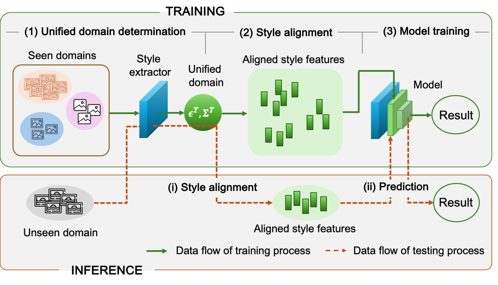

# [ICCV 2025] ConstStyle: Robust Domain Generalization with Unified Style Transformation

Official pytorch implementation of "ConstStyle: Robust Domain Generalization with Unified Style Transformation".

## Overview
Deep neural networks often suffer performance drops when test data distribution differs from training data. Domain Generalization (DG) aims to address this by focusing on domain-invariant features or augmenting data for greater diversity. However, these methods often struggle with limited training domains or significant gaps between seen (training) and unseen (test) domains. To enhance DG robustness, we hypothesize that it is essential for the model to be trained on data from domains that closely resemble unseen test domains-an inherently difficult task due to the absence of prior knowledge about the unseen domains. Accordingly, we propose ConstStyle, a novel approach that leverages a unified domain to capture domain-invariant features and bridge the domain gap with theoretical analysis. During training, all samples are mapped onto this unified domain, optimized for seen domains. During testing, unseen domain samples are projected similarly before predictions. By aligning both training and testing data within this unified domain, ConstStyle effectively reduces the impact of domain shifts, even with large domain gaps or few seen domains. Extensive experiments demonstrate that ConstStyle consistently outperforms existing methods across diverse scenarios. Notably, when only a limited number of seen domains are available, ConstStyle can boost accuracy up to 19.82\% compared to the next best approach.

## Experiments
The experiments cover three tasks: Multi-Domain Generalization, Image Corruption, and Instance Retrieval. For detailed instructions on each task, please refer to the corresponding README file.